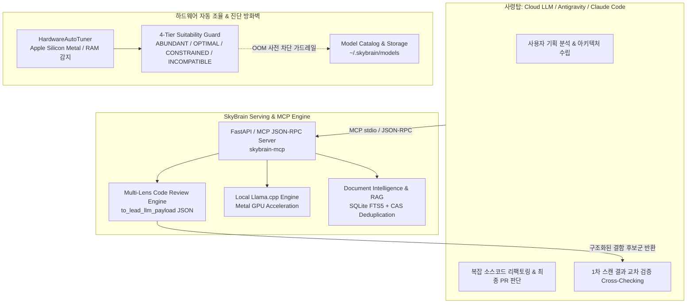

# 🏛️ SkyBrain Architecture Specification

본 문서는 `SkyBrain`의 내부 아키텍처, 설계 원칙, 프로세스 수명주기, 그리고 Metal GPU 최적화 전략을 정의합니다. SkyBrain은 **거대 Cloud LLM(Antigravity / Claude Code)을 위한 100% 온디바이스 MCP 보조자(Local SLM Co-processor)**로서 독립적 단일 정체성을 가집니다.

---

## 1. 시스템 레이어 구조

---

## 2. 핵심 컴포넌트

### 1. Model Catalog & 4-Tier Hardware Guard (`skybrain.engine.model_catalog`, `skybrain.core.hardware`)
* **저장소:** `~/.skybrain/models/`
* **지원 프리셋:**
  * `gemma-4-e4b`: `gemma-4-E4B-it-Q4_K_M.gguf` (128k 컨텍스트, Thinking Mode)
  * `gemma-2-2b`: `gemma-2-2b-it.Q4_K_M.gguf` (8k 컨텍스트, 초경량)
  * `qwen-2.5-3b`: Qwen 2.5 3B GGUF
* **HardwareAutoTuner & 4-Tier 진단 방화벽:**
  * 시스템 하드웨어(Apple Silicon Metal, RAM, VRAM)를 실시간 감지하여 최적의 GPU 레이어(`n_gpu_layers`)를 자동 산출합니다.
  * 모델 리스트 및 다운로드 시 4단계 수용성 등급(`ABUNDANT`, `OPTIMAL`, `CONSTRAINED`, `INCOMPATIBLE`)을 평가하여 저사양 환경에서의 OOM 및 커널 패닉을 원천 차단합니다.

### 2. OpenAI & MCP Compatible Server (`skybrain.server.app`, `skybrain.mcp.server`)
* **MCP 표준 도구:**
  * `skybrain_code_review`: 5대 렌즈 정밀 코드 스캔 및 거대 LLM 교차 검증용 구조화 데이터(JSON) 반환
  * `skybrain_expert_consensus`: 6대 전문 시각 기반 2/3 다수결 합의 다중 패스 코드 검증
  * `skybrain_query`: 클라우드 토큰 소모 제로($0) 로컬 Metal SLM 즉시 질의
  * `skybrain_translate`: 12개 국어 실시간 오프라인 로컬 번역
  * `skybrain_summarize_logs`: 50줄 이상 대용량 로그 노이즈 제거 및 요약
  * `skybrain_status`: 데몬 상태 및 시스템 메모리 가드 레벨 실시간 진단
  * `skybrain_doc_search`, `skybrain_doc_import`, `skybrain_doc_list`: 온디바이스 지식 검색 및 인덱싱
* **메탈 가속:** 시스템 가용 메모리에 맞춰 최적화된 GPU 레이어를 Apple Silicon Metal GPU에 오프로딩.

### 3. Daemon Supervisor (`skybrain.server.supervisor`)
* 백그라운드 프로세스 실행, PID 추적(`~/.skybrain/skybrain.pid`), 로그 파일(`~/.skybrain/skybrain.log`) 기록 및 정상 종료(Graceful Shutdown) 보장.

### 4. Zero-Leak Document Intelligence (`skybrain.store`, `skybrain.doc`)
* **100% 온디바이스 소버린 RAG:** 마크다운, 텍스트 문서 전문 검색(SQLite FTS5 BM25) 및 프로젝트 도메인 어휘 확장.
* **Content-Addressed Storage (CAS 중복 배제):** 물리적 내용(SHA-256)과 논리적 경로를 분리하여 디스크 낭비 없는 멀티 프로젝트 지식 인덱싱 지원.

### 5. Lead-LLM Cross-Check Review Engine (`skybrain.review`)
* 로컬 SLM의 한계를 명확히 인지하고, 사람이 보는 정적 HTML 대신 **거대 사령탑 LLM(Gemini/Claude)이 신속히 교차 검증할 수 있는 정형화된 JSON 페이로드(`to_lead_llm_payload()`)**를 출력합니다.
* 결함 위치, 규칙 ID, 신뢰도 점수, 그리고 사령탑 LLM을 위한 정밀 검증 가이드 프롬프트를 포함합니다.

---

## 3. 오케스트레이션 아키텍처

### Lead-LLM ↔ Local SLM Co-processor Flow
1. **사령탑 (Cloud Gemini / Claude)**: 전체 시스템 기획, 다중 파일 리팩토링, 아키텍처 결정 등 고난도 추론 전담.
2. **보조자 (Local SkyBrain MCP)**: 다국어 번역, 대용량 로그 필터링, 1차 정적/의미론적 코드 스캔, 문서 검색을 100% 로컬 Metal GPU로 처리하여 클라우드 토큰 소모 제로 및 외부 데이터 유출 방지.
3. **교차 검증 (Mutual Fact-Checking)**: SkyBrain이 반환한 후보 결함(`PRE-XX`)을 사령탑 LLM이 실제 코드와 1:1 대조하여 최종 채택/기각을 결정.

---

## 4. 라이선스
Apache-2.0 License.

