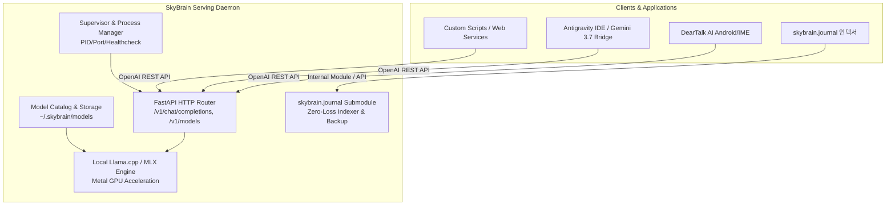

# 🏛️ SkyBrain Architecture Specification

본 문서는 `SkyBrain`의 내부 아키텍처, 설계 원칙, 프로세스 수명주기, 그리고 Metal GPU 최적화 전략을 정의합니다.

---

## 1. 시스템 레이어 구조

---

## 2. 핵심 컴포넌트

### 1. Model Catalog (`skybrain.engine.model_catalog`)
* **저장소:** `~/.skybrain/models/`
* **지원 프리셋:**
  * `gemma-4-e4b`: `gemma-4-E4B-it-Q4_K_M.gguf` (128k 컨텍스트, Thinking Mode)
  * `gemma-2-2b`: `gemma-2-2b-it.Q4_K_M.gguf` (8k 컨텍스트, 초경량)
  * `qwen-2.5-3b`: Qwen 2.5 3B GGUF
* **기능:** 원자적(Atomic) 다운로드, 상태 파일(`~/.skybrain/state.json`)을 통한 활성 모델 관리.

### 2. OpenAI Compatible Server (`skybrain.server.app`)
* **엔드포인트:**
  * `POST /v1/chat/completions` : 대화형 스트리밍/논스트리밍 추론
  * `GET /v1/models` : 로딩된 모델 및 사용 가능한 모듈 목록 반환
  * `GET /healthz` : 데몬 생존 헬스체크
* **메탈 가속:** `n_gpu_layers=-1`을 통해 모든 레이어를 Apple Silicon Metal GPU에 오프로딩.

### 3. Daemon Supervisor (`skybrain.server.supervisor`)
* 백그라운드 프로세스 실행, PID 추적(`~/.skybrain/skybrain.pid`), 로그 파일(`~/.skybrain/skybrain.log`) 기록 및 정상 종료(Graceful Shutdown) 보장.

### 4. Zero-Config Auto-Provisioning & Client Decoupling
* **무결점 자가 치유(Self-Provisioning):** `DearTalk AI`, `Antigravity IDE` 등 어떤 클라이언트든 사전 수동 설정 없이 데몬이나 스크립트(`scripts/daemon.sh`)를 가동하면 누락된 가중치를 감지하여 안전하게 자동 수급 및 서빙 상태로 진입합니다.
* **클라이언트 비종속(Zero Client Coupling):** 특정 애플리케이션에 종속된 전용 분기를 두지 않고, 오직 표준 OpenAI REST API 규격과 멱등성 런처를 통해 모든 클라이언트에 무결한 서비스를 제공합니다.

### 5. Zero-Loss Journal Submodule (`skybrain.journal`)
* **마크다운 인덱싱 & 백업:** 일자별 개발 일지를 100% 로컬에서 파싱하고, 무손실 `.gz` 백업 및 GitHub 마크다운 대시보드를 생성합니다.

---

## 3. 라이선스
Apache-2.0 License.
