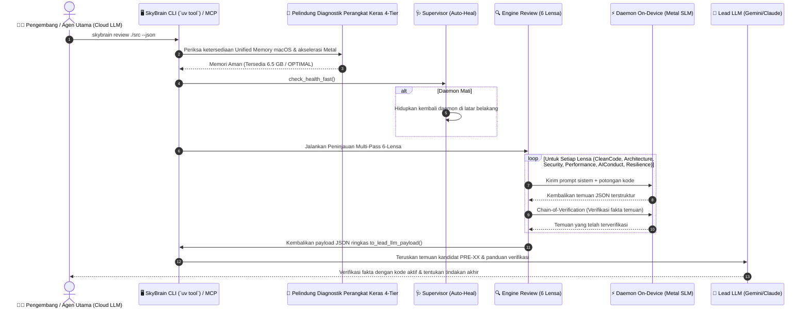

# 🧠 SkyBrain: Engine AI On-Device Universal & Peninjau Kode 5-Lensa

<div align="center">

<p align="center">
  <a href="README.md">English</a> |
  <a href="README.ko.md">한국어</a> |
  <b>Bahasa Indonesia</b>
</p>

[-black?logo=apple&logoColor=white)](#-fitur-utama-platform)
[-blueviolet)](#-akselerasi-metal-gpu-native-tanpa-docker)
[](#-rest-api-lokal-kompatibel-openai)
[-FF4088?logo=python&logoColor=white)](#-panduan-cepat-quick-start)
[](#-engine-peninjau-kode-multi-pass-6-lensa)
[](LICENSE)

**SkyBrain** adalah daemon penyedia AI on-device native kelas enterprise tanpa Docker yang dirancang khusus untuk komputer Mac Apple Silicon (M1/M2/M3/M4).

Menyediakan serving model bahasa kecil (SLM seperti Qwen, Gemma, Llama) berlatensi nol dengan akselerasi Apple Metal GPU, proxy perutean lokal dengan circuit breaker otomatis saat terjadi kuota habis (429) atau server sibuk (503), serta **Engine Peninjau Kode Multi-Pass 6-Lensa** canggih yang menghasilkan dashboard HTML interaktif mandiri.

[Fitur Utama](#-fitur-utama-platform) • [Contoh Peninjauan 6-Lensa](#-contoh-peninjauan-6-lensa-dalam-praktik) • [Cara Kerja](#-cara-kerja) • [Arsitektur](ARCHITECTURE.md) • [Panduan Cepat](#-panduan-cepat-quick-start) • [Struktur Repositori](#-struktur-repositori) • [Tata Kelola](GEMINI.md)

</div>


---

## 💡 Mengapa SkyBrain? (5 Keunggulan Arsitektur Utama)

> **"Maksimalkan potensi terpendam Metal GPU Mac Anda untuk kecepatan rekayasa terbaik—tanpa tagihan token cloud dan privasi data mutlak."**

| Keunggulan Utama | Detail & Mekanisme Arsitektur | Dampak Rekayasa & Bisnis |
| :--- | :--- | :--- |
| 💰 **Hemat Token Cloud 85%+** | Mengalihkan tugas massal repetitif (terjemahan multibahasa, boilerplate skema, pengujian unit, ringkasan log build 50+ baris) langsung ke SLM lokal (Qwen 3.8 / Gemma) | Memangkas biaya operasional API LLM cloud premium (Claude Sonnet, Gemini 1.5 Pro) secara signifikan |
| 🔒 **100% Privasi Data Air-Gapped** | Tanpa transmisi jaringan keluar (Zero Outbound). Kode sumber kepemilikan, log sistem, kunci rahasia lingkungan, dan IP tidak pernah meninggalkan komputer lokal | Memenuhi standar kepatuhan dan keamanan enterprise yang ketat tanpa rasa cemas |
| ⚡ **Kecepatan Murni Metal Tanpa Docker** | Melewati beban virtualisasi Docker; berjalan langsung di macOS, menghubungkan RAM terpadu ke inti Metal GPU Apple Silicon (M1–M4) (`-DGGML_METAL=on`) | Arsitektur zero-copy memori dan streaming token latensi ultra-rendah langsung saat digunakan |
| 🛡️ **Proteksi RAM Host & Pemulihan Mandiri** | Pelindung memori pre-flight mencegat inferensi berat saat RAM bebas di bawah 2.5 GB; supervisor pemulihan mandiri menghidupkan daemon mati di bawah 500ms via ping 150ms | Menghilangkan freeze OOM macOS dan menyediakan circuit breaker lokal yang sangat tangguh |
| 🔍 **Pemeriksaan Kualitas 6-Lensa & Anti-Palsu** | Menganalisis kode pada Clean Code, Clean Architecture, Security, Performance, AI Conduct, dan **Resilience (Pencegahan zombie handle & pemisahan siklus hidup)** | Mencegah pola anti-AI halus dan kegagalan crash IPC/mobile lolos ke produksi |

---

## 📊 Status Rilis (Release Status)

| Komponen | Versi | Arsitektur | Status | Sorotan Utama |
| :--- | :---: | :---: | :---: | :--- |
| 🧠 **SkyBrain Core & Daemon** | `v0.3.0` | **macOS Apple Silicon (Metal)** | **Production Stable** | Native Metal GPU tanpa Docker, Supervisor Pemulihan Otomatis 150ms, Pelindung Memori Host (Pre-flight RAM Guard), Circuit Breaker Tanpa Drop |
| 🔍 **Multi-Lens Review Engine** | `v0.3.0` | **6-Lens Strategy Pattern** | **Production Stable** | 6 Lensa (`CleanCode`, `Architecture`, `Security`, `Performance`, `AIConduct`, `Resilience`), Verifikasi Fakta Chain-of-Verification, Dashboard HTML Glassmorphism Interaktif |
| 🔌 **SkyBrain MCP Server** | `v0.3.0` | **Model Context Protocol** | **Production Stable** | Integrasi IDE universal (Cursor, VS Code, Antigravity IDE, Claude Desktop) |

---

## 🌟 Fitur Utama Platform

### ⚡ Akselerasi Metal GPU Native Tanpa Docker
- **Kecepatan Native Murni:** Berjalan langsung di macOS tanpa overhead virtualisasi atau beban container Docker.
- **Pemanfaatan Memori Terpadu:** Memanfaatkan arsitektur Unified Memory Apple Silicon 100% tanpa beban penyalinan memori (`-DGGML_METAL=on`).
- **SLM yang Dapat Ditukar Seketika:** Dukungan pergantian mulus antara Qwen 2.5 (3.8B/7B), Google Gemma (2B/4B E4B), dan model GGUF kustom.

### 🌐 REST API Lokal Kompatibel OpenAI
- **Kompatibilitas Penuh:** Menyediakan endpoint `/v1/chat/completions` dan `/v1/models` di `http://127.0.0.1:8000`.
- **Dukungan SDK Universal:** Terintegrasi langsung dengan SDK OpenAI Python/Node, LangChain, LiteLLM, dan LlamaIndex.
- **Pemulihan Mandiri Proxy & SSL Perusahaan:** Mendukung bundel sertifikat inspeksi SSL perusahaan (`SKYBRAIN_CA_BUNDLE`) dan pengecualian lalu lintas lokal (`NO_PROXY`).

### 🛡️ Pelindung Memori Host & Pemulihan Mandiri
- **Pelindung RAM Host (`SystemGuard`):** Terus mengukur RAM yang tersedia menggunakan `sysctl` + `vm_stat` native tanpa latensi. Mencegah macOS macet dengan membatasi inferensi berat jika sisa RAM di bawah 2.5 GB.
- **Pemulihan Otomatis di Bawah 150ms:** Pemeriksaan ping kilat sebelum setiap permintaan; jika daemon berhenti, sistem akan menghidupkannya kembali di latar belakang dalam waktu kurang dari 500ms.
- **Pembersih Proses Atomik:** Menghapus proses yatim dan zombie secara tuntas menggunakan urutan atomik `SIGTERM` ➔ `SIGKILL`.

### 🔍 Engine Peninjau Kode Multi-Pass 6-Lensa
- **Analisis Multi-Perspektif Mandiri:** Memeriksa kode sumber dari 6 disiplin rekayasa perangkat lunak:
  1. 🧹 **Lensa Clean Code:** Prinsip Robert C. Martin, Tanggung Jawab Tunggal (SRP), DRY, penamaan ekspresif.
  2. 🏛️ **Lensa Clean Architecture:** Aturan ketergantungan Uncle Bob (DIP), isolasi batas, pola Contract Facade.
  3. 🛡️ **Lensa Keamanan (Security):** OWASP Top 10, path traversal, celah injeksi, kebocoran exception.
  4. ⚡ **Lensa Kinerja (Performance):** Daur hidup sumber daya (soket/SSL), I/O pemblokir, kompleksitas algoritma.
  5. 🤖 **Lensa AI Conduct:** Mendeteksi anti-pola khas AI: hardcoding data tiruan, halusinasi API fiktif, pembungkaman exception (`except Exception: pass`), dan fungsi TODO yang belum selesai.
  6. 🔄 **Lensa Ketahanan & Siklus Hidup (Resilience - Terbaru):** Melindungi dari zombie handle IPC/Binder (Error 11 DeadProxy), pelepasan sumber daya segera saat error, serta pengujian retry backoff otomatis saat koneksi terputus sesaat.
- **Chain-of-Verification (CoVe):** Setiap temuan diverifikasi ulang oleh inferensi lokal mandiri untuk menyingkirkan alarm palsu (False Positive).
- **Cache Disk Hash Konten Tier-1:** Memberikan hasil kilat dalam 0.1 detik untuk file yang tidak berubah menggunakan hashing SHA-256.

### 🎯 Payload Data Terstruktur Khusus Verifikasi Silang Lead-LLM
- **Dioptimalkan untuk Lead LLM (Cloud AI):** Alih-alih laporan HTML peramban yang berat, SkyBrain menghasilkan JSON terstruktur (`to_lead_llm_payload()`) berisi temuan kandidat (`PRE-XX`), justifikasi aturan, rasio konsensus 2/3, dan prompt verifikasi silang khusus untuk validasi langsung oleh Cloud Gemini/Claude.
- **Pengurangan Beban Token 85%+:** Menggantikan boilerplate HTML 25KB+ dengan payload JSON ringkas <3KB, mencegah kejenuhan konteks pada agen orkestrator.
- **Skor Kesehatan Kode (0–100):** Penilaian kesehatan basis kode secara transparan dengan algoritma penalti terbobot.

### 📚 Kecerdasan Dokumen Multi-Proyek & Hub Cache Materialized
- **100% RAG Berdaulat di Perangkat (Air-Gapped):** Pengindeksan dan pencarian dokumen Markdown, TXT, dan PDF secara lokal tanpa transmisi jaringan eksternal apa pun.
- **Penyimpanan Berbasis Konten (CAS Deduplication):** Memisahkan konten fisik (SHA-256) dari jalur logis. Pemindahan/penggantian nama file memerlukan biaya re-embedding 0 detik, dan pendaftaran folder induk menggunakan kembali file sub-proyek tanpa pemborosan disk (0%).
- **Pencarian Leksikal & Ekspansi Domain Hibrida:** Pencarian teks penuh SQLite FTS5 (BM25) berkecepatan tinggi dipadukan dengan pemanenan leksikon domain proyek otomatis (`3-Tier`, `Gate 1/2/3`, `PAD`, `Zero-Fake`).
- **Prinsip Sumber Hanya-Baca (Read-Only):** Tidak pernah mengubah dokumen repositori asli; mengelola cache yang terisolasi di `~/.skybrain/knowledge.db` (mode WAL).

---

## 🎭 6-Lensa Review dalam Praktik

| Lensa | Anti-Pola yang Terdeteksi | Tingkat Keparahan | Saran Perbaikan AI |
| :--- | :--- | :---: | :--- |
| 🔄 **Resilience** | Handle IPC/Binder menggantung setelah `onError` callback | 🚨 **CRITICAL** | Hancurkan handle seketika dan inisialisasi sesi bersih baru pada permintaan berikutnya. |
| 🤖 **AI Conduct** | Hardcoding nilai tiruan `return {"status": "ok"}` | 🚨 **CRITICAL** | Terapkan query database dinamis yang sebenarnya atau lempar `NotImplementedError` eksplisit. |
| 🛡️ **Security** | `except Exception: pass` membungkam kegagalan | 🔴 **HIGH** | Tangkap exception spesifik `(json.JSONDecodeError, OSError)` dan catat dengan `logger.warning()`. |
| 🏛️ **Architecture** | Lapisan dalam bergantung langsung pada model konkret (`pelanggaran DIP`) | 🔴 **HIGH** | Terapkan **Pola Contract Facade** di `base.py` dan ekspor kembali tipe abstraksi. |
| ⚡ **Performance** | `ssl.SSLContext` dibuat berulang kali tanpa penggunaan kembali | 🟡 **MEDIUM** | Cache atau bungkus pembuatan konteks dalam fungsi helper dengan manajemen daur hidup. |
| 🧹 **Clean Code** | Angka ajaib `-1` digunakan untuk offload layer GPU | 🟡 **MEDIUM** | Deklarasikan konstanta modul secara eksplisit: `ALL_GPU_LAYERS = -1`. |

---

## 🔄 Cara Kerja



---

## 📦 Panduan Cepat (Quick Start)

### 1. Instalasi CLI Global Sekali Sentuh (`uv tool` - Direkomendasikan)
SkyBrain menerapkan **Standar Universal `uv tool`** untuk lingkungan pengembang yang terisolasi, stabil, dan berkinerja tinggi:

```bash
# Instalasi CLI global (Lingkungan terisolasi dengan akselerasi Metal)
CMAKE_ARGS="-DGGML_METAL=on" uv tool install git+https://github.com/cobuild-ai/skybrain.git

# Atau Instalasi Pengembang Lokal (Mode Editable - perubahan kode langsung aktif)
git clone https://github.com/cobuild-ai/skybrain.git
cd skybrain
CMAKE_ARGS="-DGGML_METAL=on" uv tool install --editable .
```

### 2. Skrip Penyiapan Otomatis Sekali Sentuh (`setup.sh`)
```bash
./setup.sh
```
`setup.sh` akan mendeteksi diagnostik perangkat keras 4-tier, mengompilasi binding Metal, menjalankan 94 unit test, mendaftarkan perintah global `skybrain`, dan menghasilkan konfigurasi `.vscode/mcp.json` untuk IDE.

### 3. Perintah CLI Umum
```bash
# Jalankan daemon on-device di latar belakang (Unduh otomatis model jika belum ada)
skybrain start

# Periksa status real-time & pelindung memori host
skybrain status

# Periksa katalog model dengan kesesuaian 4-tier real-time (🟢/⚠️/🛑) dan layer GPU yang disarankan
skybrain model list

# Jalankan Peninjauan Kode 5-Lensa pada file atau direktori (mendukung -j untuk JSON Lead LLM)
skybrain review ./skybrain/core/config.py -j

# Ajukan pertanyaan ke SLM on-device tanpa biaya token cloud ($0 Token)
skybrain query "Jelaskan Prinsip Pembalikan Ketergantungan (DIP) dalam Clean Architecture"

# Daftarkan direktori ke hub pengetahuan proyek dengan deduplikasi CAS
skybrain doc add ./00-governance --name "OSS-Governance"

# Cari basis pengetahuan dengan SQLite FTS5 & ekspansi leksikon domain
skybrain doc search "3-Tier Pipeline" --project oss-governance

# Tampilkan daftar proyek terdaftar dan statistik file aktif
skybrain doc list

# Sinkronisasi bertahap (Incremental Sync) untuk file yang diubah
skybrain doc sync

# Hentikan daemon latar belakang
skybrain stop
```

---

## 💻 Panduan Integrasi Model Context Protocol (MCP)

SkyBrain menyediakan server Model Context Protocol (MCP) standar (`skybrain-mcp`), memungkinkan **Antigravity IDE, Anthropic Claude CLI (Claude Code), Cursor, dan VS Code** memanfaatkan kecerdasan SLM Metal Apple Silicon lokal sebagai alat kerja berkecepatan tinggi:

### 🚀 Pendaftaran 1 Perintah

```bash
# Daftarkan SkyBrain di Anthropic Claude CLI (Claude Code)
claude mcp add skybrain -- uv tool run skybrain-mcp

# Atau periksa semua alat MCP langsung dari CLI
skybrain mcp tools
skybrain mcp setup
```

### 🛠️ 6 Alat Standar MCP yang Tersedia

| Alat MCP | Deskripsi | Kasus Penggunaan Utama |
| :--- | :--- | :--- |
| 🔍 `skybrain_code_review` | Peninjauan semantik 5-Lensa (`CleanCode`, `Architecture`, `Security`, `Performance`, `AIConduct`) | Audit PR & kualitas file di IDE |
| ⚖️ `skybrain_expert_consensus` | Evaluasi multi-pass konsensus mayoritas 2/3 di 6 perspektif khusus | Verifikasi konsensus berketelitian tinggi |
| ⚡ `skybrain_query` | Kueri langsung ke SLM Metal lokal tanpa biaya token cloud ($0) (mendukung visi multimodal) | Pembuatan draf kode cepat di perangkat |
| 🌐 `skybrain_translate` | Terjemahan lokal offline di 12 bahasa | Sinkronisasi README & dokumen multibahasa |
| 📜 `skybrain_summarize_logs` | Pemfilteran noise berkecepatan tinggi & analisis akar masalah log 50+ baris | Debugging log build aman tanpa kebocoran |
| 🩺 `skybrain_status` | Status daemon real-time, model aktif, dan tingkat pelindung memori | Pemeriksaan kesiapan perangkat keras |
| 📚 `skybrain_doc_search` | Pencarian SQLite FTS5 (BM25) multi-proyek dengan ekspansi leksikon domain proyek | Pengambilan konteks proyek instan tanpa cloud |
| 📥 `skybrain_doc_import` | Impor direktori lokal ke basis pengetahuan CAS dengan deduplikasi hemat ruang | Pendaftaran dokumen multi-proyek |
| 📋 `skybrain_doc_list` | Tampilkan daftar proyek terdaftar, jumlah dokumen, dan status indeks | Ringkasan dasbor hub pengetahuan |

### ⚙️ Konfigurasi IDE (`mcp_config.json` / `settings.json`)

```json
{
  "mcpServers": {
    "skybrain": {
      "command": "uv",
      "args": ["tool", "run", "skybrain-mcp"]
    }
  }
}
```

---

## 📁 Struktur Repositori

```
skybrain/
├── pyproject.toml              # Konfigurasi standar proyek Python modern (uv & PEP 621)
├── setup.sh                    # Skrip penyiapan otomatis & konfigurasi IDE MCP
├── ARCHITECTURE.md             # Dokumen arsitektur sistem mendalam & diagram circuit breaker
├── GEMINI.md                   # Pedoman tata kelola enterprise & prinsip Truth-First
│
├── skybrain/
│   ├── cli/                    # Perintah CLI berbasis Typer (start, stop, status, review, ask)
│   │   └── main.py
│   ├── core/                   # Pengaturan inti & pelindung perangkat keras
│   │   ├── config.py           # Pydantic BaseSettings, bundel SSL & konfigurasi proxy
│   │   └── monitor.py          # Pemantau memori sysctl/vm_stat native & SystemGuard
│   ├── engine/                 # Engine inferensi SLM Metal Apple Silicon
│   │   └── model_catalog.py    # Binding llama-cpp-python & pengunduh otomatis model GGUF
│   ├── gateway/                # Proxy Perutean Lokal & Circuit Breaker
│   │   └── proxy.py            # Klien failover otomatis cloud-ke-lokal saat HTTP 429/503
│   ├── server/                 # Daemon latar belakang FastAPI & supervisor
│   │   ├── app.py              # Endpoint /v1 standar OpenAI & telemetri memori
│   │   └── supervisor.py       # Pembersih proses atomik & supervisor pemulihan otomatis 150ms
│   ├── review/                 # Platform Peninjau Kode Multi-Pass 6-Lensa
│   │   ├── models.py           # Model domain murni (Severity, Category, Finding, Report)
│   │   ├── engine.py           # Orkestrator multi-pass dengan pelacakan Rich Progress
│   │   ├── verification.py     # Verifikator fakta Chain-of-Verification (CoVe)
│   │   ├── html_report.py      # Generator dashboard HTML glassmorphism interaktif mandiri
│   │   └── lenses/             # Lensa peninjau berbasis Strategy Pattern
│   │       ├── base.py         # Contract Facade yang mengekspor kembali tipe abstraksi
│   │       ├── clean_code.py   # Lensa prinsip Clean Code Robert C. Martin
│   │       ├── clean_architecture.py # Lensa pembalikan ketergantungan & batas lapisan
│   │       ├── security.py     # Lensa keamanan OWASP, path traversal & exception
│   │       ├── performance.py  # Lensa daur hidup sumber daya & efisiensi I/O
│   │       ├── ai_conduct.py   # Lensa audit anti-pola AI (hardcoding, halusinasi, stub)
│   │       └── resilience.py   # Lensa siklus hidup & pencegahan zombie handle
│   └── mcp/                    # Server Model Context Protocol untuk IDE
│
└── tests/                      # 111 rangkaian pengujian pytest (100% lulus)
```

---

## 🔒 Privasi, Prinsip Truth-First & Tata Kelola

1. **Protokol Truth-First (Kebijakan Nol Rekayasa):**
   - Tidak ada balasan tiruan, status palsu, atau trik regex. Semua wawasan berasal dari inferensi SLM lokal yang terverifikasi dan nyata.
2. **100% Privasi On-Device:**
   - Nol telemetri, tanpa perekaman ketikan, dan tanpa ketergantungan cloud untuk operasi lokal. Seluruh kode yang ditinjau tetap berada di dalam memori Mac Apple Silicon Anda.
3. **Mandat Standar Universal `uv tool`:**
   - Tidak ada instalasi `pip` global lawas atau masalah path virtualenv yang rentan rusak. Semua alat CLI dikelola dengan aman melalui lingkungan `uv tool` yang terisolasi dan berkinerja tinggi.

---

## 📄 Lisensi & Pemelihara

- **License:** Apache License 2.0
- **Organization:** [cobuild-ai](https://github.com/cobuild-ai)
- **Maintainer:** `smilelife` (<mysmilelife@gmail.com>)
- **Public Support:** <onthelogic@gmail.com>
