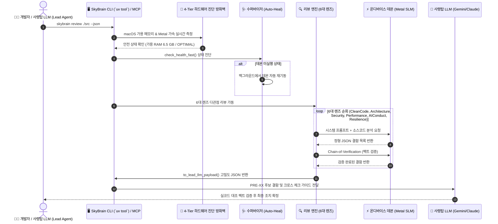

# 🧠 SkyBrain: 유니버설 온디바이스 AI 서빙 엔진 & 5대 렌즈 코드 리뷰어

<div align="center">

<p align="center">
  <a href="README.md">English</a> |
  <b>한국어</b> |
  <a href="README.id.md">Bahasa Indonesia</a>
</p>

[-black?logo=apple&logoColor=white)](#-핵심-플랫폼-기능)
[-blueviolet)](#-제로-도커-순수-네이티브-metal-gpu-가속)
[](#-openai-호환-로컬-rest-api)
[-FF4088?logo=python&logoColor=white)](#-빠른-시작-quick-start)
[](#-6대-multi-lens-전문가-코드-리뷰-엔진)
[](LICENSE)

**SkyBrain**은 macOS 및 Apple Silicon(M1/M2/M3/M4) 환경을 위해 특화 설계된 **Docker 없는 순수 네이티브 온디바이스 AI 서빙 데몬이자 엔터프라이즈 개발자 생산성 플랫폼**입니다.

Apple Metal GPU 가속 기반의 초저지연 경량 SLM(Qwen, Gemma, Llama) 로컬 서빙, 클라우드 429/503 장애 시 로컬로 무중단 전환되는 로컬 라우팅 프록시(서킷 브레이커), 그리고 인터랙티브 HTML 대시보드를 자동 생성하는 **6대 Multi-Lens 정밀 코드 리뷰 엔진**을 원스톱으로 제공합니다.

[핵심 기능](#-핵심-플랫폼-기능) • [6대 렌즈 실전 데모](#-6대-렌즈-실전-동작-예시) • [작동 원리](#-작동-원리) • [아키텍처](ARCHITECTURE.md) • [빠른 시작](#-빠른-시작-quick-start) • [프로젝트 디렉토리 구조](#-프로젝트-디렉토리-구조) • [거버넌스](GEMINI.md)

</div>


---

## 💡 왜 SkyBrain인가? (SkyBrain의 5대 핵심 이점)

> **"클라우드 AI의 막대한 토큰 비용과 데이터 유출 걱정 없이, 내 맥북의 잠자는 Metal GPU를 100% 깨워 최고의 생산성을 발휘합니다."**

| 핵심 이점 | 세부 가치 및 작동 방식 | 기대 효과 |
| :--- | :--- | :--- |
| 💰 **클라우드 토큰 85%+ 절감** | 다국어 번역, 보일러플레이트 생성, 50줄 이상의 대용량 빌드 로그 1차 요약 등 단순 반복 작업을 로컬 경량 SLM(Qwen 3.8/Gemma)에 전량 위임 | 비싼 클라우드 LLM(Gemini 1.5 Pro, Claude Sonnet) 호출 비용을 획기적으로 축소 |
| 🔒 **100% 데이터 주권 & 보안** | 외부 인터넷 통신 0건(Air-Gapped) 원칙. 민감한 내부 소스코드, 시스템 로그, 시크릿 키가 로컬 머신 외부로 단 1바이트도 유출되지 않음 | 기업 보안 및 컴플라이언스 기준 완벽 충족, 안심하고 로컬 감사 수행 |
| ⚡ **제로 도커 순수 Metal 속도** | 무거운 Docker 가상화 머신 없이 macOS 네이티브 환경에서 Apple Silicon(M1~M4) 통합 메모리와 GPU 코어를 직결 (`-DGGML_METAL=on`) | 메모리 복사 오버헤드 0ms, 초저지연 토큰 스트리밍 서빙 실현 |
| 🛡️ **호스트 메모리 보호 & 자율 복구** | 가용 RAM 2.5GB 미만 시 과중한 연산을 사전 차단(Pre-flight Guard)하여 맥북 멈춤 방지, 데몬 비정상 종료 시 150ms 핑 감지로 500ms 내 자동 재기동 | 무중단 서킷 브레이커 환경 제공 및 호스트 시스템 안정성 100% 보장 |
| 🔍 **6대 전문 렌즈 & Zero-Fake 감사** | Clean Code, Clean Architecture, Security, Performance, AI Conduct와 더불어 **IPC 좀비 핸들 방지 및 수명주기 디커플링을 감사하는 `Resilience` 렌즈** 탑재 | AI 생성 코드의 결함과 모바일/분산 런타임 크래시 벡터를 사전 차단하여 상용 무결성 확보 |

---

## 📊 릴리즈 상태 (Release Status)

| 컴포넌트 | 버전 | 아키텍처 | 상태 | 주요 핵심 특징 |
| :--- | :---: | :---: | :---: | :--- |
| 🧠 **SkyBrain Core & Daemon** | `v0.3.0` | **macOS Apple Silicon (Metal)** | **Production Stable** | 도커 없는 네이티브 Metal GPU 가속, 150ms 자율 복구 슈퍼바이저, 호스트 메모리 보호 가드(Pre-flight Memory Guard), 무중단 서킷 브레이커 |
| 🔍 **Multi-Lens Review Engine** | `v0.3.0` | **6-Lens Strategy Pattern** | **Production Stable** | 6대 전문 렌즈(`CleanCode`, `Architecture`, `Security`, `Performance`, `AIConduct`, `Resilience`), Chain-of-Verification 팩트 검증, 인터랙티브 글래스모피즘 HTML 대시보드 |
| 🔌 **SkyBrain MCP Server** | `v0.3.0` | **Model Context Protocol** | **Production Stable** | Cursor, VS Code, Antigravity IDE, Claude Desktop 전 도구 표준 연동 |

---

## 🌟 핵심 플랫폼 기능

### ⚡ 제로 도커, 순수 네이티브 Metal GPU 가속
- **가상화 없는 네이티브 속도:** 가상화 머신이나 무거운 Docker 데몬 없이 macOS 위에서 직접 동작하여 최상의 응답 속도를 발휘합니다.
- **통합 메모리(Unified Memory) 100% 활용:** 메모리 복사 오버헤드 없이 Mac 통합 메모리와 Metal GPU 코어를 온전히 활용합니다 (`-DGGML_METAL=on`).
- **온디바이스 SLM 핫스왑 지원:** Qwen 2.5(3.8B/7B), Google Gemma(2B/4B E4B), 커스텀 GGUF 모델을 자유롭게 교체 및 서빙합니다.

### 🌐 OpenAI 호환 로컬 REST API
- **완벽한 SDK 호환:** `http://127.0.0.1:8000` 상에서 표준 `/v1/chat/completions` 및 `/v1/models` 엔드포인트를 제공합니다.
- **다양한 AI 프레임워크 지원:** OpenAI 공식 Python/Node SDK, LangChain, LiteLLM, LlamaIndex와 코드 한 줄 수정 없이 즉시 연동됩니다.
- **사내망 프록시 및 SSL 자율 복구:** 기업 사내망의 SSL 복호화 프록시 인증서(`SKYBRAIN_CA_BUNDLE`)와 로컬 트래픽 우회(`NO_PROXY`)를 자체적으로 완벽 지원합니다.

### 🛡️ 사전 메모리 보호 가드 & 자율 복구 데몬
- **실시간 호스트 RAM 보호 (`SystemGuard`):** macOS native `sysctl` + `vm_stat`을 통해 가용 메모리를 0ms 오버헤드로 실시간 감시합니다. 가용 RAM이 2.5GB 미만으로 떨어지면 과중한 로컬 연산을 차단하여 맥북이 멈추는 현상(OOM Freeze)을 원천 방지합니다.
- **150ms 초고속 자율 복구(Auto-Healing):** 모든 요청 전 150ms 핑으로 상태를 진단하며, 데몬이 종료되었거나 응답하지 않으면 백그라운드에서 500ms 안에 스스로 재기동합니다.
- **원자적 프로세스 청소:** 포트 충돌 및 고아/좀비 프로세스를 `SIGTERM` ➔ `SIGKILL` 2단계 원자적 시퀀스로 깔끔하게 정리합니다.

### 🔍 6대 Multi-Lens 전문가 코드 리뷰 엔진
- **독립적 다관점(Multi-Perspective) 감사:** 단일 모델의 편향을 극복하기 위해 6대 엔지니어링 렌즈로 소스코드를 다각도 분석합니다:
  1. 🧹 **Clean Code Lens:** Robert C. Martin 원칙, 단일 책임 원칙(SRP), DRY(중복 배제), 명확한 네이밍 검증.
  2. 🏛️ **Clean Architecture Lens:** Uncle Bob 의존성 역전 원칙(DIP), 계층 간 경계 보호, Contract Facade 패턴 검증.
  3. 🛡️ **Security Lens:** OWASP Top 10, 경로 조작(Path Traversal), 주입 공격, 예외 정보 누출 차단.
  4. ⚡ **Performance Lens:** 소켓/SSL 자원 수명주기, 메인 루프 블로킹 I/O, 복잡도 최적화.
  5. 🤖 **AI Conduct Lens:** AI 생성 코드 특유의 안티패턴(가짜 mock 하드코딩, 환각된 부존재 API 호출, 무책임한 `except Exception: pass`, 미완성 TODO 스텁)을 전문 색출.
  6. 🔄 **Resilience & Lifecycle Lens (신규 탑재):** IPC/OS 바인더 좀비 핸들 방지(Error 11 DeadProxy 차단), 에러 발생 시 즉각 자원 해제, 일시적 네트워크/IPC 단절 시 자동 재시도 백오프 검증.
- **팩트 검증(Chain-of-Verification):** 검출된 모든 결함은 독립 검증 모델을 거쳐 허위 경고(False Positive)를 철저히 제거합니다.
- **Tier-1 콘텐츠 해시 디스크 캐시:** SHA-256 기반 캐싱으로 변경되지 않은 파일은 0.1초 만에 결과를 즉시 반환합니다.

### 🎯 Lead-LLM 교차 검증 전용 구조화 데이터 페이로드
- **거대 사령탑 LLM(Cloud AI) 최적화:** 브라우저용 무거운 정적 HTML 대신, 사령탑 LLM(Gemini/Claude)이 즉시 수치화하여 소스코드와 교차 검증할 수 있는 정밀 구조체(Finding ID, 위치, 결함 코드, 근거 규칙, 2/3 합의율, 교차 검증용 가이드)를 JSON으로 신속 제공.
- **토큰 밀도 85% 이상 절감:** 25KB+ HTML 보고서 오버헤드를 배제하고 3KB 미만의 초경량 JSON 페이로드(`to_lead_llm_payload()`)로 직결하여 상위 에이전트의 컨텍스트 낭비 원천 차단.
- **Code Health Score (0~100점):** 결함 심각도에 따른 감점 알고리즘으로 프로젝트 건강도를 한눈에 직관적으로 파악.

### 📚 멀티 프로젝트 문서 지능 & 캐시 허브 (Multi-Project Document Intelligence)
- **100% 온디바이스 주권형 RAG:** 외부 네트워크 전송 0건(Air-Gapped) 원칙으로 Markdown, TXT, PDF 문서를 로컬 인덱싱 및 초고속 검색.
- **콘텐츠 주소 지정(CAS 중복 제거):** 파일 경로와 실제 내용(SHA-256)을 분리하여, 파일/폴더 이동 시 재임베딩 비용 0초, 상위 폴더 추가 등록 시 기존 하위 프로젝트 파일 중복 저장 0% 실현.
- **하이브리드 어휘 & 도메인 사전 확장:** SQLite FTS5(BM25) 초고속 전문 검색과 프로젝트 고유 도메인 어휘(`3-Tier`, `Gate 1/2/3`, `PAD`, `Zero-Fake` 등) 자동 수확 및 쿼리 확장 결합.
- **원본 무변조 원칙 (Read-Only):** 프로젝트 소스 및 문서를 일체 변경하지 않고 `~/.skybrain/knowledge.db` (WAL 모드)의 고립된 캐시에서만 인덱스 관리.

---

## 🎭 6대 렌즈 실전 동작 예시

| 전문 렌즈 | 검출된 안티패턴 및 결함 | 심각도 | AI 기반 수정 제안 |
| :--- | :--- | :---: | :--- |
| 🔄 **Resilience** | `onError` 후 바인더 핸들을 파기하지 않아 DeadProxy 에러 누적 | 🚨 **CRITICAL** | 에러 콜백 즉시 핸들을 unbind/destroy하고 다음 요청 시 새로 초기화할 것. |
| 🤖 **AI Conduct** | 가짜 데이터 하드코딩 `return {"status": "ok"}` | 🚨 **CRITICAL** | 실제 동적 조회 쿼리를 구현하거나 명시적으로 `NotImplementedError`를 발생시킬 것. |
| 🛡️ **Security** | `except Exception: pass`로 장애 원인을 은폐함 | 🔴 **HIGH** | 구체적 예외 `(json.JSONDecodeError, OSError)`를 지정하고 `logger.warning()`으로 기록할 것. |
| 🏛️ **Architecture** | 내부 계층이 구체 도메인 모델에 직접 결합됨 (`DIP 위반`) | 🔴 **HIGH** | `base.py`에 **Contract Facade 패턴**을 적용하여 핵심 추상화만 re-export할 것. |
| ⚡ **Performance** | `ssl.SSLContext`가 재사용 없이 매번 생성되어 누수 위험 | 🟡 **MEDIUM** | 컨텍스트 매니저를 적용하거나 헬퍼 메서드를 통해 컨텍스트를 캐싱할 것. |
| 🧹 **Clean Code** | GPU 레이어 오프로드에 매직 넘버 `-1`이 설명 없이 사용됨 | 🟡 **MEDIUM** | 모듈 상단에 명시적인 상수 `ALL_GPU_LAYERS = -1`을 정의하고 사용할 것. |

---

## 🔄 작동 원리



---

## 📦 빠른 시작 (Quick Start)

### 1. 초고속 글로벌 CLI 설치 (`uv tool` 표준 권장)
SkyBrain은 가상환경 충돌과 의존성 오염을 100% 방지하기 위해 **Universal `uv tool` 표준**을 강제합니다:

```bash
# 글로벌 CLI 단독 격리 설치 (Metal GPU 가속 빌드 포함)
CMAKE_ARGS="-DGGML_METAL=on" uv tool install git+https://github.com/cobuild-ai/skybrain.git

# 또는 로컬 소스코드 기반 개발자 설치 (Editable Mode - 코드 수정 즉시 반영)
git clone https://github.com/cobuild-ai/skybrain.git
cd skybrain
CMAKE_ARGS="-DGGML_METAL=on" uv tool install --editable .
```

### 2. 제로 컨피그 원터치 셋업 스크립트 (`setup.sh`)
```bash
./setup.sh
```
`setup.sh`는 하드웨어 4단계 자동 진단, Metal 바인딩 컴파일, 94개 단위 테스트 검증, `skybrain` 전역 명령어 등록, VS Code/Cursor용 `.vscode/mcp.json` 생성을 한 번에 완결합니다.

### 3. 주요 CLI 명령어 모음
```bash
# 백그라운드 AI 서빙 데몬 시작 (모델 미설치 시 자동 다운로드 지원)
skybrain start

# 실시간 상태 확인 및 호스트 RAM 보호 가드 진단
skybrain status

# 4단계 시스템 수용성(🟢/⚠️/🛑)과 GPU 레이어가 결합된 모델 목록 확인
skybrain model list

# 단일 파일 또는 전체 디렉토리 5대 렌즈 코드 리뷰 실행 (사령탑 LLM용 JSON 출력 지원: -j)
skybrain review ./skybrain/core/config.py -j

# 로컬 온디바이스 SLM 단발성 즉시 질의 ($0 Token)
skybrain query "클린 아키텍처의 의존성 역전 원칙(DIP)을 요약해줘"

# 디렉토리를 프로젝트 지식 허브로 등록 (CAS 중복 배제 인덱싱)
skybrain doc add ./00-governance --name "OSS-Governance"

# SQLite FTS5 & 도메인 어휘 확장을 통한 지식 검색
skybrain doc search "3-Tier 배포 파이프라인" --project oss-governance

# 등록된 프로젝트 목록 및 활성 파일 현황 확인
skybrain doc list

# 변경된 파일 증분 동기화 (Incremental Sync)
skybrain doc sync

# 백그라운드 데몬 안전 종료
skybrain stop
```

---

## 💻 Model Context Protocol (MCP) 연동 가이드

SkyBrain은 공식 Model Context Protocol(MCP) 표준 서버(`skybrain-mcp`)를 탑재하여, **Antigravity IDE, Anthropic Claude CLI (Claude Code), Cursor, VS Code** 등에서 로컬 Apple Silicon Metal SLM 지능을 1급 시민(First-Class) 도구로 즉시 활용할 수 있습니다:

### 🚀 명령어 1줄 등록

```bash
# Anthropic Claude CLI (Claude Code) 공식 등록
claude mcp add skybrain -- uv tool run skybrain-mcp

# 도구 목록 및 통합 설정 안내 확인
skybrain mcp tools
skybrain mcp setup
```

### 🛠️ 제공되는 6대 표준 MCP 도구

| MCP 도구 | 기능 설명 | 주요 활용처 |
| :--- | :--- | :--- |
| 🔍 `skybrain_code_review` | 5대 렌즈 정밀 코드 리뷰 (`CleanCode`, `Architecture`, `Security`, `Performance`, `AIConduct`) | IDE 내 원클릭 PR/파일 품질 감사 |
| ⚖️ `skybrain_expert_consensus` | 6대 전문 시각 기반 2/3 다수결 합의 다중 패스 코드 검증 | 고신뢰도 아키텍처 합의 검증 |
| ⚡ `skybrain_query` | 클라우드 토큰 소모 제로($0) 로컬 Metal SLM 즉시 질의 (비전/멀티모달 지원) | 단일 파일 코드 초안 및 아이디어 생성 |
| 🌐 `skybrain_translate` | 12개 국어 실시간 오프라인 로컬 번역 | README 및 다국어 리소스 동기화 |
| 📜 `skybrain_summarize_logs` | 50줄 이상의 대용량 빌드/런타임 로그에서 노이즈 제거 및 원인 요약 | 외부 유출 없는 안전한 로그 디버깅 |
| 🩺 `skybrain_status` | 데몬 실행 상태, 활성 모델, RAM/메모리 가드 레벨 실시간 진단 | 로컬 하드웨어 및 서비스 상태 점검 |
| 📚 `skybrain_doc_search` | 멀티 프로젝트 SQLite FTS5 (BM25) 전문 검색 및 도메인 어휘 확장 | 제로 클라우드 프로젝트 컨텍스트 즉시 검색 |
| 📥 `skybrain_doc_import` | 디렉토리를 CAS 지식 베이스로 임포트 (공간 낭비 없는 중복 배제) | 다중 프로젝트 문서 등록 및 인덱싱 |
| 📋 `skybrain_doc_list` | 등록된 프로젝트 목록, 문서 수, 인덱싱 현황 요약 | 지식 허브 현황 대시보드 |

### ⚙️ IDE 설정 파일 (`mcp_config.json` / `settings.json`)

```json
{
  "mcpServers": {
    "skybrain": {
      "command": "uv",
      "args": ["tool", "run", "skybrain-mcp"]
    }
  }
}
```

---

## 📁 프로젝트 디렉토리 구조

```
skybrain/
├── pyproject.toml              # 최신 Python 프로젝트 표준 설정 (uv & PEP 621)
├── setup.sh                    # 원터치 환경 구성 및 IDE MCP 설정 스크립트
├── ARCHITECTURE.md             # 심층 시스템 아키텍처 및 서킷 브레이커 설계 문서
├── GEMINI.md                   # Truth-First 및 엔터프라이즈 거버넌스 불변 원칙
│
├── skybrain/
│   ├── cli/                    # Typer 기반 CLI 명령어 (start, stop, status, review, ask)
│   │   └── main.py
│   ├── core/                   # 핵심 도메인 설정 및 하드웨어 가드
│   │   ├── config.py           # Pydantic BaseSettings, 사내 SSL 번들 및 프록시 설정
│   │   └── monitor.py          # native sysctl/vm_stat 메모리 감시기 및 SystemGuard
│   ├── engine/                 # Apple Silicon Metal SLM 추론 엔진
│   │   └── model_catalog.py    # llama-cpp-python 바인딩 및 GGUF 모델 자동 다운로더
│   ├── gateway/                # 로컬 라우팅 프록시 & 서킷 브레이커
│   │   └── proxy.py            # HTTP 429/503 클라우드 장애 시 로컬 자동 복구 클라이언트
│   ├── server/                 # FastAPI 백그라운드 데몬 및 프로세스 감시
│   │   ├── app.py              # OpenAI 규격 /v1 엔드포인트 및 메모리 텔레메트리
│   │   └── supervisor.py       # 원자적 프로세스 킬러 및 150ms 자율 복구 수퍼바이저
│   ├── review/                 # 6대 Multi-Lens 코드 리뷰 플랫폼
│   │   ├── models.py           # 순수 도메인 엔티티 (Severity, Category, Finding, Report)
│   │   ├── engine.py           # Rich Progress 진행률 추적을 지원하는 오케스트레이터
│   │   ├── verification.py     # 허위 경고를 제거하는 Chain-of-Verification 팩트 검증기
│   │   ├── html_report.py      # 단일 파일 자립형 인터랙티브 HTML 대시보드 생성기
│   │   └── lenses/             # Strategy Pattern 기반 6대 전문 렌즈
│   │       ├── base.py         # 핵심 추상화를 재수출하는 Contract Facade
│   │       ├── clean_code.py   # Robert C. Martin 클린 코드 원칙 렌즈
│   │       ├── clean_architecture.py # 의존성 역전 및 계층 경계 보호 렌즈
│   │       ├── security.py     # OWASP 및 예외 안전성 보안 렌즈
│   │       ├── performance.py  # 자원 누수 및 I/O 블로킹 성능 렌즈
│   │       ├── ai_conduct.py   # AI 안티패턴(가짜 하드코딩, 환각, 스텁) 전문 감사 렌즈
│   │       └── resilience.py   # 수명주기 디커플링 및 좀비 핸들 방지 렌즈
│   └── mcp/                    # IDE 연동 표준 Model Context Protocol 서버
│
└── tests/                      # 111개 단위 테스트 스위트 (100% 무결점 통과)
```

---

## 🔒 개인정보 보호, 진실 우선 & 거버넌스 철학

1. **진실 우선 원칙 (Truth-First Protocol & Zero Fake):**
   - 가짜 응답, 날조된 상태 문자열, 정규식 기반 트릭을 일체 배제하며, 모든 리뷰와 결과는 실제 검증된 로컬 SLM 추론으로부터 도출됩니다.
2. **100% 온디바이스 프라이버시 (Zero Network):**
   - 사용자의 코드와 텍스트는 Apple Silicon Mac의 통합 메모리 밖으로 단 1바이트도 유출되지 않으며, 외부 전송 없이 로컬에서 완결됩니다.
3. **`uv tool` 단일 표준 정책:**
   - 파이썬 버전 충돌이나 가상환경 오염 없이 누구나 안정적으로 전역 명령어를 실행할 수 있도록 Rust 기반 `uv tool` 표준만을 사용합니다.

---

## 📄 라이선스 및 관리자 연락처

- **License:** Apache License 2.0
- **Organization:** [cobuild-ai](https://github.com/cobuild-ai)
- **Maintainer:** `smilelife` (<mysmilelife@gmail.com>)
- **Public Support:** <onthelogic@gmail.com>
