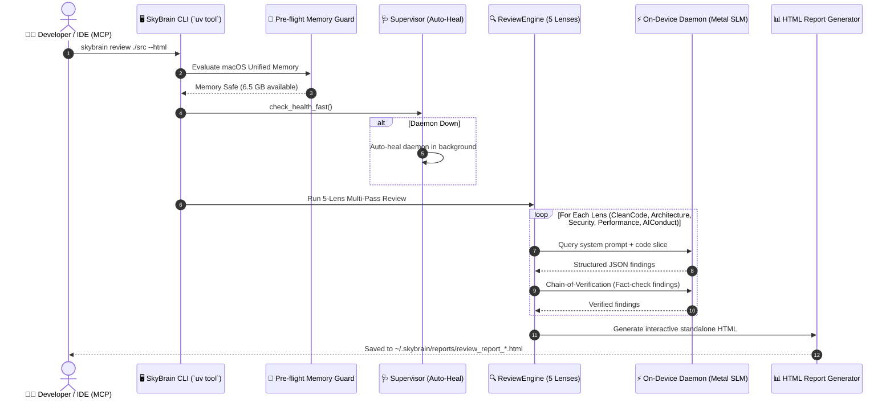

# 🧠 SkyBrain: Universal On-Device AI Engine & Multi-Lens Reviewer

<div align="center">

<p align="center">
  <b>English</b> |
  <a href="README.ko.md">한국어</a> |
  <a href="README.id.md">Bahasa Indonesia</a>
</p>

[-black?logo=apple&logoColor=white)](#-key-platform-features)
[-blueviolet)](#-zero-docker-native-metal-gpu-acceleration)
[](#-openai-compatible-local-rest-api)
[-FF4088?logo=python&logoColor=white)](#-quick-start)
[](#-5-lens-multi-pass-code-review-engine)
[](LICENSE)

**SkyBrain** is an enterprise-grade, Docker-free, pure-native on-device AI serving daemon and developer productivity platform designed specifically for Apple Silicon (M1/M2/M3/M4) Macs.

It provides zero-latency SLM/LLM local serving (Qwen, Gemma, Llama) with Apple Metal GPU acceleration, a robust local routing proxy with automatic cloud-to-local circuit breaker failover, and a state-of-the-art **5-Lens Multi-Pass Code Review Engine** producing standalone interactive HTML dashboards.

[Key Features](#-key-platform-features) • [Review Demo & Samples](#-5-lens-review-in-action) • [How It Works](#-how-it-works) • [Architecture](ARCHITECTURE.md) • [Quick Start](#-quick-start) • [Repository Structure](#-repository-structure) • [Governance](GEMINI.md)

</div>

---

## 📊 Release Status

| Component | Version | Architecture | Status | Primary Highlights |
| :--- | :---: | :---: | :---: | :--- |
| 🧠 **SkyBrain Core & Daemon** | `v0.2.0` | **macOS Apple Silicon (Metal)** | **Production Stable** | Docker-Free Native Metal GPU, 150ms Auto-Healing Supervisor, Pre-flight Host Memory Guard, Zero-Drop Circuit Breaker |
| 🔍 **Multi-Lens Review Engine** | `v0.2.0` | **5-Lens Strategy Pattern** | **Production Stable** | 5 Lenses (`CleanCode`, `Architecture`, `Security`, `Performance`, `AIConduct`), Chain-of-Verification, Interactive Glassmorphism HTML Dashboard |
| 🔌 **SkyBrain MCP Server** | `v0.2.0` | **Model Context Protocol** | **Production Stable** | Universal IDE integration (Cursor, VS Code, Antigravity, Claude Desktop) |

---

## 🌟 Key Platform Features

### ⚡ Zero-Docker, Native Metal GPU Acceleration
- **Pure Native Speed:** Runs directly on macOS without virtualization overhead or Docker daemon bloat.
- **Unified Memory Utilization:** Fully utilizes Apple Silicon Unified Memory architecture with zero memory copy penalties (`-DGGML_METAL=on`).
- **Hot-Swappable SLMs:** Seamless switching between Qwen 2.5 (3.8B/7B), Google Gemma (2B/4B E4B), and custom GGUF models.

### 🌐 OpenAI-Compatible Local REST API
- **Drop-In Compatibility:** Serves `/v1/chat/completions` and `/v1/models` on `http://127.0.0.1:8000`.
- **Universal SDK Support:** Compatible with OpenAI Python/Node SDKs, LangChain, LiteLLM, and LlamaIndex.
- **Corporate Proxy & SSL Self-Healing:** Native support for corporate MITM SSL inspection bundles (`SKYBRAIN_CA_BUNDLE`) and proxy exclusion (`NO_PROXY`).

### 🛡️ Pre-flight Host Memory Guard & Auto-Healing
- **Host Memory Protection (`SystemGuard`):** Continuously measures available RAM via native `sysctl` + `vm_stat`. Prevents macOS freezes by intercepting heavy inference when free memory falls below 2.5 GB.
- **Sub-150ms Auto-Healing:** High-speed heartbeat ping before every request; if the daemon crashed or stopped, it revives in the background automatically in under 500ms.
- **Atomic Process Cleaner:** Eliminates orphaned and zombie processes cleanly using atomic `SIGTERM` ➔ `SIGKILL` sequencing.

### 🔍 5-Lens Multi-Pass Code Review Engine
- **Blind Multi-Perspective Analysis:** Reviews source code across 5 independent architectural disciplines:
  1. 🧹 **Clean Code Lens:** Robert C. Martin principles, Single Responsibility (SRP), DRY, expressive naming.
  2. 🏛️ **Clean Architecture Lens:** Uncle Bob dependency rule, boundary isolation, Contract Facade pattern.
  3. 🛡️ **Security Lens:** OWASP Top 10, path traversal, injection vectors, unhandled exception leaks.
  4. ⚡ **Performance Lens:** Resource lifecycles (sockets/SSL), blocking I/O on hot paths, complexity.
  5. 🤖 **AI Conduct Lens (New):** Detects subtle AI-generated anti-patterns: fake mock hardcoding, hallucinated APIs, silent exception swallowing (`except Exception: pass`), and unfinished stubs.
- **Chain-of-Verification (CoVe):** Every detected finding is cross-verified by an independent on-device verification pass to eliminate false positives.
- **Tier-1 Content Hash Disk Cache:** Instant sub-second results for unchanged files using SHA-256 caching.

### 📊 Standalone Interactive HTML Reports
- **Single-File Zero-Dependency:** Self-contained HTML report with modern dark-mode glassmorphism styling.
- **Real-Time Interactive Filtering:** Filter findings by lens, severity (`CRITICAL`, `HIGH`, `MEDIUM`, `LOW`), or dynamic search query.
- **Code Health Score (0–100):** Algorithmic penalty-weighted score assessing overall codebase health.
- **One-Click Suggestion Copy:** Instant clipboard export for code fixes.

### 🔀 Local Routing Proxy & Circuit Breaker (Local Gateway)
- **Zero-Drop Failover:** Routes requests to cloud LLMs (Gemini, Claude, OpenAI) while continuously monitoring quotas.
- **Instant Local Recovery:** Automatically flips to local on-device SLM on HTTP 429 (Rate Limit / Quota Exceeded) or 503 (Overloaded) without dropping user queries.

---

## 🎭 5-Lens Review in Action

| Lens | Detected Anti-Pattern | Severity | AI-Driven Fix & Suggestion |
| :--- | :--- | :---: | :--- |
| 🤖 **AI Conduct** | Fake hardcoded mock return `return {"status": "ok"}` | 🚨 **CRITICAL** | Implement actual database query or raise explicit `NotImplementedError`. |
| 🛡️ **Security** | `except Exception: pass` silently swallowing errors | 🔴 **HIGH** | Catch specific `(json.JSONDecodeError, OSError)` and log with `logger.warning()`. |
| 🏛️ **Architecture** | Inner layer directly importing concrete models (`DIP violation`) | 🔴 **HIGH** | Apply **Contract Facade Pattern** in `base.py` and re-export abstractions. |
| ⚡ **Performance** | `ssl.SSLContext` created repeatedly without resource reuse | 🟡 **MEDIUM** | Cache or wrap context creation in a lifecycle-managed helper. |
| 🧹 **Clean Code** | Magic number `-1` used for offloading all GPU layers | 🟡 **MEDIUM** | Declare explicit module constant `ALL_GPU_LAYERS = -1`. |

---

## 🔄 How It Works



---

## 📦 Quick Start

### 1. One-Touch Global CLI Installation (`uv tool` - Recommended)
SkyBrain enforces the **Universal `uv tool` Standard** for isolated, reproducible, zero-friction developer experience:

```bash
# Global CLI installation (Isolated environment with Metal acceleration)
CMAKE_ARGS="-DGGML_METAL=on" uv tool install git+https://github.com/cobuild-ai/skybrain.git

# Or Local Developer Editable Installation (Live source reflection)
git clone https://github.com/cobuild-ai/skybrain.git
cd skybrain
CMAKE_ARGS="-DGGML_METAL=on" uv tool install --editable .
```

### 2. Zero-Config One-Touch Setup Script (`setup.sh`)
```bash
./setup.sh
```
`setup.sh` automatically checks Apple Silicon hardware, compiles Metal bindings, runs 111 unit tests, registers the `skybrain` global CLI, and generates `.vscode/mcp.json` for IDE integration.

### 3. Common CLI Operations
```bash
# Start background on-device daemon (Auto-downloads default SLM if missing)
skybrain start

# Check real-time status & host memory guard
skybrain status

# Execute 5-Lens Multi-Pass Code Review on a file or directory
skybrain review ./skybrain/core/config.py

# Ask local on-device SLM a zero-token question
skybrain ask "Explain Clean Architecture Dependency Inversion Principle"

# Ask with cloud escalation and automatic local circuit breaker fallback
skybrain ask "Draft an architectural refactoring plan" --cloud

# Stop background daemon
skybrain stop
```

---

## 💻 Model Context Protocol (MCP) Integration

SkyBrain includes a built-in Model Context Protocol (MCP) server, instantly connecting your local Apple Silicon SLM to **Cursor, VS Code (Cline / Roo Code), Claude Desktop, and Antigravity IDE**:

* **Available MCP Tools**:
  * `skybrain_expert_consensus`: Run 5-Lens multi-pass code review directly within your IDE.
  * `skybrain_query`: Query on-device Metal SLM with 0 cloud token cost.
  * `skybrain_translate`: Instant offline translation across 12 languages.
  * `skybrain_summarize_logs`: Fast offline summarization of large build/runtime logs.

---

## 📁 Repository Structure

```
skybrain/
├── pyproject.toml              # Modern Python project configuration (uv & PEP 621)
├── setup.sh                    # Automated one-touch setup and MCP configuration script
├── ARCHITECTURE.md             # In-depth system architecture & circuit breaker diagrams
├── GEMINI.md                   # Truth-First & enterprise governance guidelines
│
├── skybrain/
│   ├── cli/                    # Typer-based CLI commands (start, stop, status, review, ask)
│   │   └── main.py
│   ├── core/                   # Core settings & host hardware guards
│   │   ├── config.py           # Pydantic BaseSettings, SSL bundles & proxy configuration
│   │   └── monitor.py          # Native sysctl/vm_stat memory monitor & SystemGuard
│   ├── engine/                 # Apple Silicon Metal SLM inference engine
│   │   └── model_catalog.py    # llama-cpp-python bindings, GGUF catalog & auto-downloader
│   ├── gateway/                # Local Routing Proxy & Circuit Breaker
│   │   └── proxy.py            # HTTP 429/503 cloud-to-local zero-drop failover client
│   ├── server/                 # FastAPI background daemon & supervisor
│   │   ├── app.py              # OpenAI-compatible /v1 endpoints & memory telemetry
│   │   └── supervisor.py       # Atomic process killer & sub-150ms auto-healing supervisor
│   ├── review/                 # 5-Lens Multi-Pass Code Review Platform
│   │   ├── models.py           # Pure domain models (Severity, Category, Finding, Report)
│   │   ├── engine.py           # Multi-pass orchestrator with Rich Progress tracking
│   │   ├── verification.py     # Chain-of-Verification (CoVe) fact-checker
│   │   ├── html_report.py      # Standalone interactive glassmorphism HTML generator
│   │   └── lenses/             # Strategy Pattern review lenses
│   │       ├── base.py         # Contract Facade re-exporting abstractions
│   │       ├── clean_code.py   # Robert C. Martin clean code principles
│   │       ├── clean_architecture.py # Dependency Inversion & layer boundary rules
│   │       ├── security.py     # OWASP, path traversal & exception leakage rules
│   │       ├── performance.py  # Resource lifecycle, memory leaks & blocking I/O
│   │       └── ai_conduct.py   # AI anti-patterns: fake hardcoding, hallucination & stubs
│   └── mcp/                    # Model Context Protocol server for IDEs
│
└── tests/                      # 111 comprehensive pytest test suites (100% passing)
```

---

## 🔒 Privacy, Truth-First & Governance Principles

1. **Truth-First Protocol (Zero Fake Policy):**
   - No mock responses, fake status strings, or regex hacks pretending to be AI intelligence. All insights originate from real, verified local SLM inference.
2. **100% On-Device Privacy:**
   - Zero telemetry, zero keystroke recording, and zero cloud dependencies for local operations. All code reviewed remains strictly inside your Apple Silicon Mac's unified memory.
3. **Universal `uv tool` Mandate:**
   - No legacy global `pip install` or brittle virtual environment path dependencies. All Python CLI tools are strictly managed through isolated, high-speed `uv tool` environments.

---

## 📄 License & Maintainers

- **License:** Apache License 2.0
- **Organization:** [cobuild-ai](https://github.com/cobuild-ai)
- **Maintainer:** `smilelife` (<mysmilelife@gmail.com>)
- **Public Support:** <deartalkai.dev@gmail.com>
