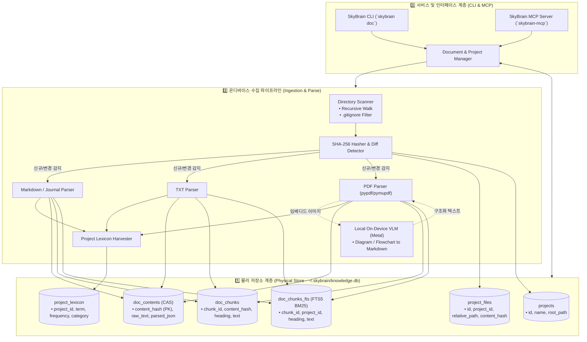
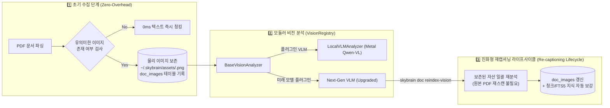

# 🏛️ SkyBrain Document Intelligence & Multi-Project Knowledge Hub Architecture
**Document Version:** v1.0.0  
**Target Engine:** SkyBrain v0.2.0+ (Apple Silicon Metal On-Device)  
**Security & Privacy:** Air-Gapped / Sovereign AI (Zero Cloud Outbound)

---

## 1. 정체성 및 시스템 철학 (Identity & Philosophy)

SkyBrain은 단순한 로컬 LLM 서빙 도구가 아닌, 개발자의 로컬 머신에서 구동되는 **"100% 온디바이스 주권형 지식 허브(Sovereign On-Device Knowledge Hub)"**입니다.

### 4대 불변 원칙 (Core Invariants)
1. **🛡️ 순수 온디바이스 주권 (Air-Gapped Sovereignty)**:
   - 외부 클라우드 API, 서드파티 네트워크 호출을 0건으로 제한합니다.
   - 모든 텍스트 파싱, 벡터 임베딩, 다이어그램 시각 이해는 로컬 Apple Silicon (Metal GPU/NPU) 상에서만 완결됩니다.
2. **🔒 원본 무변조 원칙 (Read-Only Source Principle)**:
   - 프로젝트 원본 디렉토리(`Journal/`, `docs/`, `00-governance/` 등)의 파일은 읽기 전용으로만 접근하며, 절대로 변조하거나 이동시키지 않습니다.
3. **⚡ 콘텐츠 주소 지정 (Content-Addressed Storage - CAS Deduplication)**:
   - 파일 경로(Logical Path)와 실제 파일 내용(Physical Content)을 1:N으로 분리합니다.
   - SHA-256 해시를 키로 삼아, **파일/폴더 이동 시 재임베딩 비용 0초**, **상위/하위 폴더 일괄 등록 시 디스크 공간 낭비 0%**를 보장합니다.
4. **🔌 단일 표준 MCP 게이트웨이 (Unified MCP Gateway)**:
   - Model Context Protocol (MCP) 표준 도구를 통해 Antigravity, Claude, Cursor 등 어떤 AI 클라이언트든 로컬 지식 캐시에 초고속으로 접근합니다.

---

## 2. 전체 시스템 아키텍처 (System Architecture)



---

## 3. 데이터베이스 스키마 설계 (Database Schema)

데이터베이스는 `~/.skybrain/knowledge.db`에 위치하며, 동시성 다중 읽기(Concurrent Multi-Read)를 위해 `PRAGMA journal_mode = WAL;`을 필수로 적용합니다.

```sql
PRAGMA journal_mode = WAL;
PRAGMA foreign_keys = ON;

-- 1. 프로젝트 테넌시 정의
CREATE TABLE IF NOT EXISTS projects (
    id TEXT PRIMARY KEY,               -- e.g. "ossproject"
    name TEXT NOT NULL,                -- e.g. "OSSProject"
    root_path TEXT NOT NULL UNIQUE,    -- e.g. "/Users/.../OSSProject"
    created_at DATETIME DEFAULT CURRENT_TIMESTAMP
);

-- 2. 프로젝트 소속 파일 메타데이터 (논리적 경로)
CREATE TABLE IF NOT EXISTS project_files (
    id INTEGER PRIMARY KEY AUTOINCREMENT,
    project_id TEXT NOT NULL REFERENCES projects(id) ON DELETE CASCADE,
    relative_path TEXT NOT NULL,
    absolute_path TEXT NOT NULL UNIQUE,
    content_hash TEXT NOT NULL REFERENCES doc_contents(content_hash),
    mtime REAL NOT NULL,
    size_bytes INTEGER NOT NULL,
    status TEXT DEFAULT 'ACTIVE',       -- ACTIVE, MOVED, DELETED
    last_synced_at DATETIME DEFAULT CURRENT_TIMESTAMP
);
CREATE INDEX IF NOT EXISTS idx_files_project ON project_files(project_id);
CREATE INDEX IF NOT EXISTS idx_files_hash ON project_files(content_hash);

-- 3. 콘텐츠 주소 지정 본문 캐시 (CAS Deduplication)
CREATE TABLE IF NOT EXISTS doc_contents (
    content_hash TEXT PRIMARY KEY,     -- SHA-256
    doc_type TEXT NOT NULL,            -- md, txt, pdf
    raw_text TEXT NOT NULL,
    metadata_json TEXT,                -- title, headings, tags, image_count 등
    created_at DATETIME DEFAULT CURRENT_TIMESTAMP
);

-- 4. 본문 청크 (Chunking by Section)
CREATE TABLE IF NOT EXISTS doc_chunks (
    chunk_id TEXT PRIMARY KEY,         -- content_hash + "_" + index
    content_hash TEXT NOT NULL REFERENCES doc_contents(content_hash) ON DELETE CASCADE,
    chunk_index INTEGER NOT NULL,
    heading_hierarchy TEXT,            -- e.g. "00-governance > 3-Tier Pipeline"
    chunk_text TEXT NOT NULL
);
CREATE INDEX IF NOT EXISTS idx_chunks_hash ON doc_chunks(content_hash);

-- 5. FTS5 전문 검색 가상 테이블 (BM25 Lexical Search)
CREATE VIRTUAL TABLE IF NOT EXISTS doc_chunks_fts USING fts5(
    chunk_id UNINDEXED,
    project_id,
    heading_hierarchy,
    chunk_text,
    tokenize = 'porter unicode61'
);

-- 6. 프로젝트 고유 도메인 어휘집 (Lexicon Harvesting & Query Expansion)
CREATE TABLE IF NOT EXISTS project_lexicon (
    id INTEGER PRIMARY KEY AUTOINCREMENT,
    project_id TEXT NOT NULL REFERENCES projects(id) ON DELETE CASCADE,
    term TEXT NOT NULL,
    frequency INTEGER DEFAULT 1,
    category TEXT DEFAULT 'KEYWORD',   -- KEYWORD, ACRONYM, GOVERNANCE, COMPONENT
    UNIQUE(project_id, term)
);
-- 7. 영구 시각 자산 보존 및 모듈러 비전 인덱스 (Modular Visual Asset Store)
CREATE TABLE IF NOT EXISTS doc_images (
    image_hash TEXT PRIMARY KEY,       -- 이미지 바이너리 SHA-256
    content_hash TEXT NOT NULL REFERENCES doc_contents(content_hash) ON DELETE CASCADE,
    page_num INTEGER NOT NULL,
    image_index INTEGER NOT NULL,
    image_name TEXT,
    mime_type TEXT DEFAULT 'image/png',
    size_bytes INTEGER NOT NULL,
    storage_path TEXT,                 -- ~/.skybrain/assets/{image_hash}.png
    ocr_text TEXT,                     -- 텍스트 OCR 결과
    diagram_summary TEXT,              -- 아키텍처/순서도/다이어그램 시각 이해
    vision_model TEXT,                 -- 분석에 사용된 VLM 모델 명 (e.g. qwen2.5-vl)
    confidence REAL DEFAULT 1.0,
    analyzed_at DATETIME DEFAULT CURRENT_TIMESTAMP
);
CREATE INDEX IF NOT EXISTS idx_images_content ON doc_images(content_hash);
CREATE INDEX IF NOT EXISTS idx_images_model ON doc_images(vision_model);
```

---

## 4. CAS 수집 및 동기화 라이프사이클 (Ingestion Lifecycle)

### 4.1. 단일 파일 및 디렉토리 등록 (`doc add <path>`, `skybrain_doc_import`)
1. **경로 정규화**: 절대 경로 변환 및 단일 파일(`file.pdf`, `file.md`) 또는 디렉토리 자동 판별.
2. **재귀 파일 수집**: 디렉토리인 경우 `.gitignore`, 숨김 폴더(`.git`, `.venv`), 바이너리 빌드 디렉토리(`build`, `dist`, `node_modules`) 자동 제외.
3. **콘텐츠 해시 계산**: 각 파일의 SHA-256 해시를 산출.
4. **Deduplication 검사**:
   - `doc_contents`에 해당 해시가 이미 존재하는 경우: 파싱/VLM/청킹 건너뜀! `project_files`에 외래키 연결만 0초 완료.
   - 존재하지 않는 경우: 포맷별 파서 실행 후 본문, 청크, 시각 자산, FTS5 인덱스 생성.

### 4.2. 증분 동기화 (`doc sync [project]`)
1. 등록된 모든 파일의 파일 시스템 `mtime`과 `size`를 확인.
2. 불일치하는 파일만 SHA-256을 재계산.
3. 디스크에서 삭제된 파일은 `status = 'DELETED'`로 마킹 (고아 청크는 가비지 컬렉션).
4. 이동된 파일(경로는 바뀌었으나 해시가 동일한 경우)은 `project_files`의 경로만 즉시 업데이트.

---

## 5. 규격화된 온디바이스 비전 자산 지능 (Modular Vision Asset Architecture)

문서의 완전한 사실을 보존하기 위해 다이어그램, 아키텍처 구조도, 순서도 등 **모든 시각 자산을 원본 해시 단위로 물리 보존(`doc_images`)**하고, VLM의 성능 개선에 맞춰 점진적으로 진화하는 규격화/모듈화 아키텍처를 채택합니다.



### 5.1. 시각 자산 규격화 3대 핵심 원칙
1. **🖼️ 물리적 원본 보존 (Persistent Visual Asset)**:
   - 문서 파싱 시 추출된 이미지(도표, 다이어그램, 캡처)는 `~/.skybrain/assets/{image_hash}.png`에 영구 보존됩니다.
   - LLM이 초기에 시각 자산을 완벽히 이해하지 못하더라도, 원본 자산이 보존되어 있으므로 원본 문서가 삭제되거나 수정되어도 시각 데이터가 유실되지 않습니다.
2. **🧩 모듈러 VLM 레지스트리 (`VisionRegistry`)**:
   - `BaseVisionAnalyzer` 추상 인터페이스를 통해 비전 백엔드를 완벽히 디커플링했습니다.
   - 초기에는 경량 메타데이터 및 OCR을 수행하다가, 고성능 로컬 VLM(Qwen 2.5-VL, Qwen 3-VL 등)이 로컬에 배포되면 백엔드만 즉시 전환할 수 있습니다.
3. **🔄 비파괴적 진화 및 재캡셔닝 (`reindex_vision`)**:
   - `DocumentManager.reindex_vision(target_model=...)` API를 통해, 보존된 `doc_images` 목록 중 구버전 모델로 분석되었거나 분석이 누락된 이미지만 골라내어 최신 VLM으로 일괄 재분석(Re-captioning)합니다.
   - 원본 문서를 처음부터 다시 읽거나 전체 인덱스를 재구축할 필요 없이, **시각 지식 레이어만 한순간에 최신 AI 지능으로 도약**합니다.

---

## 6. MCP 도구 명세 (Model Context Protocol)

| 도구명 | 매개변수 | 설명 |
| :--- | :--- | :--- |
| `skybrain_doc_search` | `query: str`, `project: Optional[str] = None`, `limit: int = 5` | 프로젝트별 또는 전역 FTS5/BM25 + 어휘 확장 하이브리드 문서 검색 (투명성 메타데이터 포함) |
| `skybrain_doc_import` | `path: str`, `project_name: Optional[str] = None` | 특정 폴더를 재귀 탐색하여 프로젝트 지식 스토어로 임포트 |
| `skybrain_doc_list` | 없음 | 등록된 프로젝트 목록, 파일 수, 청크 수, 동기화 상태 요약 반환 |
| `skybrain_doc_sync` | `project_name: Optional[str] = None` | 변경된 파일 증분 동기화 실행 |

### 6.1. 검색 응답 투명성 스키마 (`engine_metadata`)
외부 호출자(대형 LLM)가 응답의 신뢰도를 판별할 수 있도록 아래 출처 메타데이터를 필수로 반환합니다:
- `retrieval_mode`: `"FTS5_BM25_LEXICAL"` 또는 `"HYBRID_LLM_ENHANCED"`
- `llm_enhanced`: 로컬 LLM 추론 개입 여부 (`boolean`)
- `local_daemon_active`: 로컬 서빙 데몬 기동 여부 (`boolean`)
- `active_model`: 관여한 로컬 모델 명칭
- `confidence_level`: `"EXACT_SOURCE_RAW"` (원본 1:1 발췌)
- `contains_vlm_diagram`: 개별 청크 내 VLM 다이어그램 해석 포함 여부 (`boolean`)

---

## 7. 결론 및 향후 확장 로드맵
- **Phase 1**: CAS 기반 SQLite FTS5 멀티 프로젝트 스토어, Markdown/TXT/PDF 파서, CLI 및 MCP 도구 연동.
- **Phase 2**: `sqlite-vec` 플러그인을 결합한 로컬 Dense Vector 임베딩 (하이브리드 RAG).
- **Phase 3**: 로컬 VLM 비전 모델 파이프라인 연동 강화 (Qwen 2.5-VL Metal Zero-Cloud 추론).
